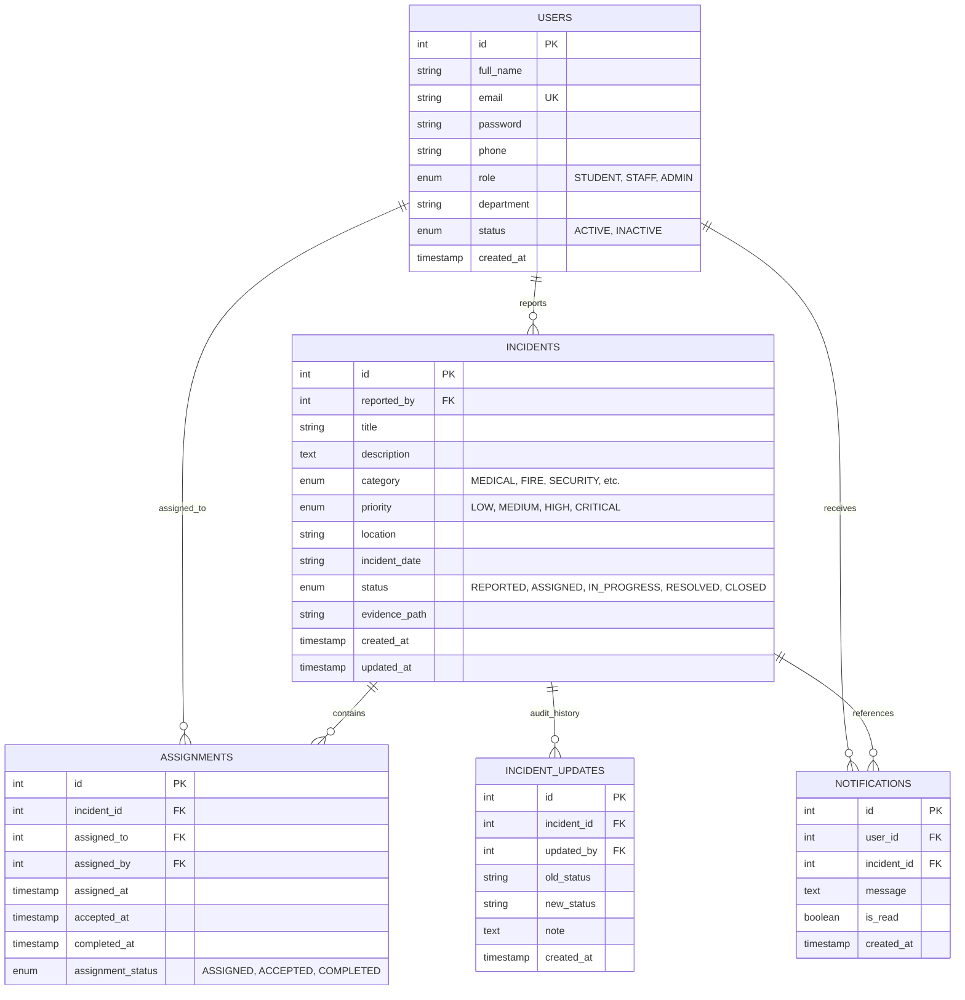

# Smart Campus Emergency & Incident Management System

A centralized Java EE Web Application designed for reporting, managing, assigning, tracking, and resolving campus incidents and emergencies.

---

## Table of Contents
1. [Project Overview](#1-project-overview)
2. [Key Features](#2-key-features)
3. [Technology Stack](#3-technology-stack)
4. [Prerequisites & System Requirements](#4-prerequisites--system-requirements)
5. [Database Setup (MySQL)](#5-database-setup-mysql)
6. [Configuring Database Credentials](#6-configuring-database-credentials)
7. [Building the Project (Maven)](#7-building-the-project-maven)
8. [Deploying & Running on Apache Tomcat 10+](#8-deploying--running-on-apache-tomcat-10)
9. [Pre-Configured Demo Credentials](#9-pre-configured-demo-credentials)
10. [Application Workflow & Lifecycle](#10-application-workflow--lifecycle)
11. [Project Directory Structure](#11-project-directory-structure)
12. [Database Schema Design](#12-database-schema-design)
13. [Testing & Verification Guide](#13-testing--verification-guide)
14. [Troubleshooting & Common Questions](#14-troubleshooting--common-questions)

---

## 1. Project Overview
The **Smart Campus Emergency & Incident Management System** provides a digital safety network for colleges and universities. It replaces slow, error-prone manual paper logs with an automated workflow where students and staff can immediately report campus incidents (fires, medical emergencies, electrical faults, harassment, etc.) and campus security/administration can dispatch responders, track work progress, and maintain a full audit trail.

---

## 2. Key Features

### 🎓 Student Role:
- Self-registration with department classification (enforced `STUDENT` role).
- Incident reporting form with emergency level classification, location tagging, and optional photo/evidence upload.
- Personal incident dashboard with live status indicators.
- Interactive vertical incident timeline with full audit notes.
- Ability to submit supplementary notes/clarifications to open reports.
- Real-time in-app notification center.

### 🛡️ Staff / Responder Role:
- Staff dashboard showing assigned tasks, pending responses, and resolved cases.
- One-click task acceptance (`ASSIGNED` $\rightarrow$ `IN_PROGRESS`).
- Ability to post progress notes and work updates.
- Work completion & resolution submission (`IN_PROGRESS` $\rightarrow$ `RESOLVED`).

### ⚙️ Admin Role:
- Centralized Command Center with 7 KPI metrics and critical emergency alerts.
- Filterable and searchable master registry across all campus incidents.
- Staff dispatcher modal to assign/reassign incidents to campus responders.
- Priority and Category reclassification tool.
- Official case verification and closure (`RESOLVED` $\rightarrow$ `CLOSED`).
- User Management: View students/staff, provision new staff, toggle active status, and safeguarded account deletion.
- Visual Reports & Safety Analytics (CSS-driven distribution charts by category, priority, status, and department).

---

## 3. Technology Stack

- **Backend:** Java 17, Java Servlets (Jakarta Servlet API 5.0+), JDBC
- **Frontend:** JSP, HTML5, CSS3, Vanilla JavaScript, Bootstrap 5.3, FontAwesome 6
- **Database:** MySQL 8.0+
- **Build Tool:** Apache Maven
- **Server:** Apache Tomcat 10.1+ (Jakarta EE namespace `jakarta.*`)

---

## 4. Prerequisites & System Requirements

1. **Java Development Kit (JDK):** Version 17 or higher
2. **MySQL Server:** Version 8.0 or higher (or XAMPP / WAMP with MySQL)
3. **Apache Tomcat:** Version 10.0 or 10.1+
4. **Apache Maven:** Version 3.8+ (or Eclipse / IntelliJ Maven integration)

---

## 5. Database Setup (MySQL)

1. Open your terminal or MySQL Workbench / Command Line Client:
   ```bash
   mysql -u root -p
   ```
2. Run the provided database script [`database.sql`](file:///C:/Users/Ilakiya%20R/.gemini/antigravity/scratch/smart-campus-incident/database.sql):
   ```sql
   source C:/Users/Ilakiya R/.gemini/antigravity/scratch/smart-campus-incident/database.sql;
   ```
   *(Or copy-paste the contents of `database.sql` directly into MySQL Workbench / phpMyAdmin and execute)*.

3. Verify tables were created:
   ```sql
   USE smart_campus_incident;
   SHOW TABLES;
   ```
   You will see 5 tables: `users`, `incidents`, `assignments`, `incident_updates`, and `notifications`.

---

## 6. Configuring Database Credentials

The database connection parameters are defined in:
[`src/main/java/com/smartcampus/util/DBConnection.java`](file:///C:/Users/Ilakiya%20R/.gemini/antigravity/scratch/smart-campus-incident/src/main/java/com/smartcampus/util/DBConnection.java)

By default, the utility connects to:
- **Host:** `localhost:3306`
- **Database:** `smart_campus_incident`
- **Username:** `root`
- **Password:** `root` *(with automatic fallback to blank `""` for XAMPP)*

To change the credentials, either edit `DBConnection.java` or provide environment variables / JVM properties:
```properties
DB_HOST=localhost
DB_PORT=3306
DB_NAME=smart_campus_incident
DB_USER=root
DB_PASS=your_mysql_password
```

---

## 7. Building the Project (Maven)

Open PowerShell or Command Prompt in the project root directory:

```powershell
cd "C:\Users\Ilakiya R\.gemini\antigravity\scratch\smart-campus-incident"
mvn clean package
```

This compiles all Java source files and generates the deployable WAR file:
`target/smart-campus-incident.war`

---

## 8. Deploying & Running on Apache Tomcat 10+

### Option A: Manual Deployment (Tomcat `webapps` folder)
1. Copy `target/smart-campus-incident.war` into your Tomcat `webapps` directory:
   ```powershell
   copy target\smart-campus-incident.war "C:\apache-tomcat-10.1.x\webapps\"
   ```
2. Start Tomcat:
   ```powershell
   "C:\apache-tomcat-10.1.x\bin\startup.bat"
   ```
3. Open your web browser and navigate to:
   ```
   http://localhost:8080/smart-campus-incident/
   ```

### Option B: Eclipse / IntelliJ IDE Deployment
1. Import the project as **Existing Maven Project**.
2. Configure **Apache Tomcat 10.1+** as the Server runtime.
3. Add the project to the server and click **Run / Debug**.

---

## 9. Pre-Configured Demo Credentials

For quick evaluation, click the demo shortcut pills on the login screen or enter manually:

| Role | Email | Password | Department / Function |
|---|---|---|---|
| **ADMIN** | `admin@campus.com` | `admin123` | Campus Administration |
| **STAFF (Security)** | `security@campus.com` | `staff123` | Campus Security & Patrol |
| **STAFF (Medical)** | `medical@campus.com` | `staff123` | Health & Medical Services |
| **STAFF (Maintenance)**| `electrical@campus.com`| `staff123` | Facilities & Maintenance |
| **STUDENT** | `student@campus.com` | `student123` | Computer Science |

---

## 10. Application Workflow & Lifecycle

The system strictly enforces the following linear status lifecycle:

$$\text{REPORTED} \longrightarrow \text{ASSIGNED} \longrightarrow \text{IN\_PROGRESS} \longrightarrow \text{RESOLVED} \longrightarrow \text{CLOSED}$$

1. **REPORTED:** Student submits an incident with location, category, and urgency.
2. **ASSIGNED:** Admin reviews the incident and dispatches an active staff responder.
3. **IN PROGRESS:** Staff accepts the task and begins on-site resolution.
4. **RESOLVED:** Staff completes corrective action and files resolution remarks.
5. **CLOSED:** Admin verifies the completed work and archives the case.

> [!NOTE]
> Every single status change, note, or reassignment automatically appends an entry to `incident_updates` and triggers notifications to all concerned parties.

---

## 11. Project Directory Structure

```
smart-campus-incident/
 ├── pom.xml                                   <- Maven project configuration & dependencies
 ├── database.sql                              <- Full MySQL database schema + sample data
 ├── README.md                                 <- Comprehensive setup documentation
 └── src/
     └── main/
         ├── java/com/smartcampus/
         │   ├── controller/                   <- Jakarta Servlets (Request Handlers)
         │   │   ├── LoginServlet.java
         │   │   ├── RegisterServlet.java
         │   │   ├── LogoutServlet.java
         │   │   ├── StudentDashboardServlet.java
         │   │   ├── StaffDashboardServlet.java
         │   │   ├── AdminDashboardServlet.java
         │   │   ├── ReportIncidentServlet.java
         │   │   ├── MyIncidentsServlet.java
         │   │   ├── ViewIncidentServlet.java
         │   │   ├── AssignIncidentServlet.java
         │   │   ├── UpdateStatusServlet.java
         │   │   ├── UpdateIncidentServlet.java
         │   │   ├── AddIncidentUpdateServlet.java
         │   │   ├── NotificationServlet.java
         │   │   ├── UserManagementServlet.java
         │   │   ├── ReportsServlet.java
         │   │   └── DeleteIncidentServlet.java
         │   │
         │   ├── dao/                          <- Data Access Objects (JDBC PreparedStatements)
         │   │   ├── UserDAO.java
         │   │   ├── IncidentDAO.java
         │   │   ├── AssignmentDAO.java
         │   │   ├── IncidentUpdateDAO.java
         │   │   └── NotificationDAO.java
         │   │
         │   ├── model/                        <- Java Bean Models
         │   │   ├── User.java
         │   │   ├── Incident.java
         │   │   ├── Assignment.java
         │   │   ├── IncidentUpdate.java
         │   │   └── Notification.java
         │   │
         │   ├── filter/                       <- Security & RBAC Filter
         │   │   └── AuthFilter.java
         │   │
         │   └── util/                         <- Database Utilities
         │       └── DBConnection.java
         │
         └── webapp/
             ├── index.jsp                     <- Landing page
             ├── login.jsp                     <- Login page with demo autofill
             ├── register.jsp                  <- Student registration
             ├── access-denied.jsp             <- 403 Forbidden page
             ├── error.jsp                     <- 404/500 Error handler
             ├── css/
             │   └── style.css                 <- Polished modern custom CSS
             ├── js/
             │   └── script.js                 <- Form validation & search interactivity
             ├── includes/                     <- Modular JSP fragments
             │   ├── header.jsp
             │   ├── footer.jsp
             │   ├── sidebar.jsp
             │   └── alerts.jsp
             ├── student/                      <- Student views
             │   ├── dashboard.jsp
             │   ├── report-incident.jsp
             │   ├── my-incidents.jsp
             │   ├── incident-details.jsp
             │   └── notifications.jsp
             ├── staff/                        <- Staff views
             │   ├── dashboard.jsp
             │   ├── assigned-incidents.jsp
             │   └── incident-details.jsp
             ├── admin/                        <- Admin views
             │   ├── dashboard.jsp
             │   ├── incidents.jsp
             │   ├── users.jsp
             │   ├── assignments.jsp
             │   ├── reports.jsp
             │   └── incident-details.jsp
             ├── uploads/                      <- Local evidence storage
             └── WEB-INF/
                 └── web.xml                   <- Web deployment descriptor
```

---

## 12. Database Schema Design



---

## 13. Testing & Verification Guide

1. **Testing Student Flow:**
   - Log in as `student@campus.com` / `student123`.
   - Click **Report Incident**, select `ELECTRICAL`, enter Location `Block D Room 101`, and Submit.
   - Verify it appears under **My Incidents** with status `REPORTED`.
   - Open the incident details and verify the initial timeline item.

2. **Testing Admin Dispatch Flow:**
   - Log out and log in as `admin@campus.com` / `admin123`.
   - See the new incident on the Dashboard and click **Assign**.
   - Select `Mark Davis (Facilities & Maintenance)` and confirm.
   - Status updates to `ASSIGNED`.

3. **Testing Staff Resolution Flow:**
   - Log in as `electrical@campus.com` / `staff123`.
   - Under **Assigned Tasks**, click **Accept Assignment & Start Work** (`ASSIGNED` $\rightarrow$ `IN_PROGRESS`).
   - Click **Add Progress Note**, enter a comment, then click **Mark as Resolved** (`IN_PROGRESS` $\rightarrow$ `RESOLVED`).

4. **Testing Admin Closure Flow:**
   - Log in as `admin@campus.com`.
   - Open the resolved incident and click **Verify & Close Incident** (`RESOLVED` $\rightarrow$ `CLOSED`).

---

## 14. Troubleshooting & Common Questions

- **HTTP 404 on Tomcat startup:** Ensure the WAR file is copied to `webapps/` and extracted without errors, or open `http://localhost:8080/smart-campus-incident/`.
- **Database Connection Refused:** Ensure your MySQL service is running on port 3306 and that `database.sql` has been executed.
- **Access Denied Error:** The application includes a security filter `AuthFilter`. You cannot access `/admin/*` without an `ADMIN` role session.
